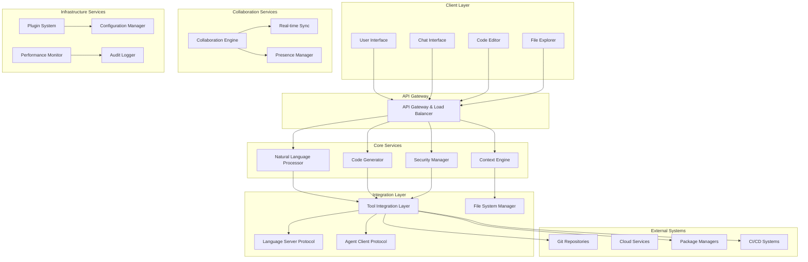

# Design Document: Agentic AI IDE

## Overview

The Agentic AI IDE is a next-generation development environment that combines traditional IDE functionality with autonomous AI capabilities. The system enables developers to interact with their codebase through natural language, receive intelligent assistance, and automate complex development workflows while maintaining full control over their projects.

The architecture follows a microservices approach with clear separation of concerns, enabling scalability, maintainability, and extensibility. The system supports both cloud-based and local execution modes to balance performance, privacy, and resource requirements.

### Key Design Principles

1. **AI-First Architecture**: Every component is designed to work seamlessly with AI agents
2. **Security by Design**: Comprehensive sandboxing and permission systems protect user data and systems
3. **Protocol Standardization**: Leverages existing protocols (LSP, ACP) and introduces new ones where needed
4. **Extensibility**: Plugin architecture allows third-party extensions and customizations
5. **Performance**: Optimized for large codebases and real-time collaboration
6. **Privacy**: Flexible execution modes support both cloud and local processing

## Architecture

The system follows a layered microservices architecture with the following main components:



### Execution Modes

The system supports three execution modes:

1. **Local Mode**: All AI processing occurs on the user's machine
2. **Cloud Mode**: AI processing occurs on remote servers
3. **Hybrid Mode**: Sensitive operations run locally, resource-intensive tasks run in the cloud

## Components and Interfaces

### Natural Language Processor

The Natural Language Processor (NLP) component interprets user inputs and converts them into actionable commands.

**Core Responsibilities:**
- Parse natural language inputs using transformer-based models
- Extract intent and entities from user requests
- Handle ambiguity resolution through clarifying questions
- Maintain conversation context and history
- Support multi-modal inputs (text, voice, images)

**Key Interfaces:**
```typescript
interface NaturalLanguageProcessor {
  processInput(input: MultiModalInput): Promise<ParsedIntent>
  clarifyAmbiguity(context: ConversationContext): Promise<ClarificationQuestion>
  extractEntities(text: string): Promise<EntityMap>
  maintainContext(conversation: Conversation): void
}

interface ParsedIntent {
  action: ActionType
  entities: EntityMap
  confidence: number
  alternatives: ParsedIntent[]
}
```

### Code Generator

The Code Generator creates, modifies, and analyzes code based on user requests and system context.

**Core Responsibilities:**
- Generate syntactically correct code in multiple languages
- Modify existing code while preserving functionality
- Maintain code style consistency
- Validate generated code for syntax and semantic errors
- Support incremental code modifications

**Key Interfaces:**
```typescript
interface CodeGenerator {
  generateCode(spec: CodeSpecification): Promise<GeneratedCode>
  modifyCode(existing: CodeBlock, modifications: Modification[]): Promise<ModifiedCode>
  validateCode(code: string, language: Language): Promise<ValidationResult>
  analyzeCode(code: string): Promise<CodeAnalysis>
}

interface CodeSpecification {
  language: Language
  requirements: string[]
  context: ProjectContext
  style: CodeStyle
}
```

### Context Engine

The Context Engine maintains awareness of the project state, user intent, and system context.

**Core Responsibilities:**
- Index and search project files and dependencies
- Maintain semantic understanding of code relationships
- Track user workflow and preferences
- Provide contextual suggestions and recommendations
- Cache frequently accessed information for performance

**Key Interfaces:**
```typescript
interface ContextEngine {
  indexProject(projectPath: string): Promise<ProjectIndex>
  searchSemantic(query: string): Promise<SearchResult[]>
  getContext(location: CodeLocation): Promise<ContextInfo>
  updateContext(changes: ContextChange[]): Promise<void>
  getRecommendations(context: WorkflowContext): Promise<Recommendation[]>
}

interface ProjectIndex {
  files: FileIndex[]
  dependencies: DependencyGraph
  symbols: SymbolTable
  relationships: RelationshipMap
}
```

### Security Manager

The Security Manager provides comprehensive security and sandboxing capabilities.

**Core Responsibilities:**
- Sandbox AI-generated code execution
- Manage permissions and access controls
- Audit all AI actions and system modifications
- Scan code for security vulnerabilities
- Enforce security policies per project and user

**Key Interfaces:**
```typescript
interface SecurityManager {
  createSandbox(config: SandboxConfig): Promise<Sandbox>
  validatePermissions(action: Action, context: SecurityContext): Promise<boolean>
  scanCode(code: string): Promise<SecurityScanResult>
  auditAction(action: Action, result: ActionResult): Promise<void>
  enforcePolicy(policy: SecurityPolicy): Promise<void>
}

interface Sandbox {
  execute(code: string): Promise<ExecutionResult>
  installPackage(package: PackageSpec): Promise<InstallResult>
  accessFile(path: string, mode: AccessMode): Promise<FileHandle>
  destroy(): Promise<void>
}
```

### Tool Integration Layer

The Tool Integration Layer provides standardized interfaces for external tools and services.

**Core Responsibilities:**
- Integrate with Language Server Protocol (LSP) servers
- Support Agent Client Protocol (ACP) for AI agent communication
- Manage connections to external tools (Git, package managers, CI/CD)
- Provide unified API for tool interactions
- Handle tool lifecycle and error recovery

**Key Interfaces:**
```typescript
interface ToolIntegrationLayer {
  registerLSPServer(server: LSPServerConfig): Promise<void>
  registerACPAgent(agent: ACPAgentConfig): Promise<void>
  executeTool(tool: ToolSpec, params: ToolParams): Promise<ToolResult>
  getAvailableTools(): Promise<ToolDescriptor[]>
}

interface LSPServerConfig {
  language: string
  serverPath: string
  initializationOptions: Record<string, any>
}
```

### File System Manager

The File System Manager handles all file operations with intelligent search and navigation capabilities.

**Core Responsibilities:**
- Provide semantic file search across projects
- Support fuzzy matching and typo tolerance
- Maintain file change tracking and history
- Integrate with version control systems
- Optimize file operations for large codebases

**Key Interfaces:**
```typescript
interface FileSystemManager {
  searchFiles(query: SearchQuery): Promise<FileSearchResult[]>
  watchChanges(path: string): Observable<FileChange>
  getFileHistory(path: string): Promise<FileHistory>
  createFile(path: string, content: string): Promise<void>
  modifyFile(path: string, changes: FileChange[]): Promise<void>
}

interface SearchQuery {
  text: string
  filters: SearchFilter[]
  fuzzy: boolean
  semantic: boolean
}
```

### Collaboration Engine

The Collaboration Engine enables real-time multi-user development with AI assistance.

**Core Responsibilities:**
- Synchronize file changes across multiple users using CRDTs
- Coordinate AI agent responses to avoid conflicts
- Provide presence awareness and user activity tracking
- Support collaborative code review and discussion
- Handle conflict resolution with AI assistance

**Key Interfaces:**
```typescript
interface CollaborationEngine {
  joinSession(sessionId: string, user: User): Promise<CollaborationSession>
  synchronizeChanges(changes: Change[]): Promise<void>
  coordinateAIResponses(request: AIRequest): Promise<CoordinatedResponse>
  getPresence(): Promise<PresenceInfo[]>
  resolveConflict(conflict: Conflict): Promise<Resolution>
}

interface CollaborationSession {
  users: User[]
  sharedState: SharedState
  aiCoordinator: AICoordinator
}
```

### Plugin System

The Plugin System provides extensibility through a secure plugin architecture.

**Core Responsibilities:**
- Load and manage third-party plugins
- Provide standardized plugin API
- Sandbox plugin execution for security
- Support both UI and AI capability extensions
- Maintain plugin marketplace integration

**Key Interfaces:**
```typescript
interface PluginSystem {
  loadPlugin(plugin: PluginDescriptor): Promise<LoadedPlugin>
  unloadPlugin(pluginId: string): Promise<void>
  getPluginAPI(): PluginAPI
  sandboxPlugin(plugin: LoadedPlugin): Promise<SandboxedPlugin>
}

interface PluginAPI {
  registerCommand(command: Command): void
  registerAICapability(capability: AICapability): void
  accessFileSystem(): FileSystemAPI
  accessUI(): UIAPI
}
```

## Data Models

### Core Data Structures

**Project Model:**
```typescript
interface Project {
  id: string
  name: string
  path: string
  language: Language[]
  dependencies: Dependency[]
  configuration: ProjectConfig
  metadata: ProjectMetadata
}

interface ProjectConfig {
  buildSystem: BuildSystemType
  testFramework: TestFrameworkType
  linting: LintingConfig
  formatting: FormattingConfig
  aiPreferences: AIPreferences
}
```

**Code Model:**
```typescript
interface CodeBlock {
  id: string
  content: string
  language: Language
  location: CodeLocation
  metadata: CodeMetadata
  dependencies: CodeDependency[]
}

interface CodeLocation {
  file: string
  startLine: number
  endLine: number
  startColumn: number
  endColumn: number
}
```

**User Model:**
```typescript
interface User {
  id: string
  name: string
  email: string
  preferences: UserPreferences
  permissions: Permission[]
  workspaces: Workspace[]
}

interface UserPreferences {
  theme: Theme
  keyBindings: KeyBinding[]
  aiSettings: AISettings
  collaborationSettings: CollaborationSettings
}
```

**AI Interaction Model:**
```typescript
interface Conversation {
  id: string
  userId: string
  projectId: string
  messages: Message[]
  context: ConversationContext
  metadata: ConversationMetadata
}

interface Message {
  id: string
  type: MessageType
  content: MultiModalContent
  timestamp: Date
  metadata: MessageMetadata
}
```

**Security Model:**
```typescript
interface SecurityPolicy {
  id: string
  name: string
  rules: SecurityRule[]
  scope: PolicyScope
  enforcement: EnforcementLevel
}

interface SecurityRule {
  action: ActionPattern
  condition: Condition
  effect: Effect
  priority: number
}
```

### Data Storage Strategy

**Local Storage:**
- User preferences and workspace configurations
- Cached project indexes and search results
- Conversation history and context
- Plugin data and configurations

**Cloud Storage:**
- Shared project data and collaboration state
- AI model weights and training data
- Audit logs and security events
- Plugin marketplace and updates

**Hybrid Storage:**
- Sensitive data remains local (credentials, private keys)
- Non-sensitive data can be cloud-synced for collaboration
- User controls data residency preferences per project

## Correctness Properties

*A property is a characteristic or behavior that should hold true across all valid executions of a system—essentially, a formal statement about what the system should do. Properties serve as the bridge between human-readable specifications and machine-verifiable correctness guarantees.*

Based on the prework analysis of acceptance criteria, the following properties have been identified as testable through property-based testing:

### Natural Language Processing Properties

**Property 1: Natural Language Intent Parsing**
*For any* natural language input, the Natural_Language_Processor should produce a valid ParsedIntent object with appropriate action mappings and confidence scores
**Validates: Requirements 1.1**

**Property 2: Ambiguity Resolution**
*For any* ambiguous natural language request, the AI_Agent should ask clarifying questions rather than making assumptions or proceeding with uncertain interpretations
**Validates: Requirements 1.2**

**Property 3: Context-Aware Processing**
*For any* natural language processing operation, the Context_Engine should incorporate current project context, file contents, and conversation history into the interpretation
**Validates: Requirements 1.3, 3.1, 3.2**

### Code Generation and Modification Properties

**Property 4: Syntactic Correctness**
*For any* code generation request, the Code_Generator should produce syntactically valid code that passes language-specific syntax validation
**Validates: Requirements 2.1, 2.4**

**Property 5: Functionality Preservation**
*For any* code modification operation, existing functionality should be preserved unless explicitly instructed otherwise, verified through behavioral equivalence testing
**Validates: Requirements 2.2, 2.6**

**Property 6: Style Consistency**
*For any* code changes made to an existing codebase, the generated code should maintain consistent style patterns with the existing code
**Validates: Requirements 2.3**

### Multi-Modal Input Processing Properties

**Property 7: Input Modality Support**
*For any* input type (text, voice, image), the Agentic_AI_IDE should accept, process, and convert it to actionable development tasks
**Validates: Requirements 4.1, 4.2, 4.4, 4.5**

**Property 8: Seamless Modality Switching**
*For any* interaction sequence involving multiple input modalities, the system should maintain context and allow seamless transitions between input types
**Validates: Requirements 4.6**

### Conversation and Context Properties

**Property 9: Conversation Persistence**
*For any* conversation sequence, the AI_Agent should maintain history, context, and support contextual references across multiple exchanges
**Validates: Requirements 5.2, 5.3, 5.5**

**Property 10: Contextual Suggestions**
*For any* development context (language, framework, current file), the AI_Agent should provide relevant suggestions and completions specific to that context
**Validates: Requirements 3.4, 3.5, 14.4**

### File System and Navigation Properties

**Property 11: Semantic File Search**
*For any* search query, the File_System_Manager should return results based on semantic understanding and intent rather than just keyword matching
**Validates: Requirements 14.1, 14.2**

**Property 12: Real-Time File Synchronization**
*For any* file operation performed by the AI, the file explorer view should update immediately and provide clear visual indicators of changes
**Validates: Requirements 6.2, 6.5**

**Property 13: Fuzzy Search Tolerance**
*For any* search query containing typos or partial matches, the File_System_Manager should provide relevant results through fuzzy matching
**Validates: Requirements 14.3**

### Collaboration Properties

**Property 14: Multi-User Coordination**
*For any* scenario with multiple active users, the Collaboration_Engine should coordinate AI responses and prevent conflicts while maintaining real-time synchronization
**Validates: Requirements 7.1, 7.2, 7.3**

**Property 15: Conflict Resolution**
*For any* conflict arising from concurrent user actions, the Collaboration_Engine should provide AI-assisted resolution mechanisms
**Validates: Requirements 7.6**

### Tool Integration Properties

**Property 16: Shell Command Execution**
*For any* shell command request, the AI_Agent should execute commands in the appropriate environment and provide real-time output with error analysis when failures occur
**Validates: Requirements 9.1, 9.3, 9.4**

**Property 17: Git Operation Support**
*For any* Git operation request, the Tool_Integration_Layer should provide full functionality while the AI_Agent analyzes repository state and suggests appropriate actions
**Validates: Requirements 10.1, 10.2**

**Property 18: Package Manager Integration**
*For any* package management operation, the Tool_Integration_Layer should support multiple package managers and provide dependency analysis and resolution
**Validates: Requirements 11.1, 11.2, 11.3**

### Testing and Quality Assurance Properties

**Property 19: Automated Test Generation**
*For any* code component, the AI_Agent should generate appropriate unit tests, integration tests, and property-based tests that provide meaningful coverage
**Validates: Requirements 12.1, 12.4**

**Property 20: Test Maintenance**
*For any* code change, the AI_Agent should automatically update affected tests and maintain test suite integrity
**Validates: Requirements 12.2**

**Property 21: Code Quality Analysis**
*For any* code analysis request, the AI_Agent should perform static analysis, highlight issues, and provide actionable suggestions for improvement
**Validates: Requirements 15.2, 15.4, 19.1, 19.2**

### Security and Sandboxing Properties

**Property 22: Security Isolation**
*For any* AI-generated code execution, the Security_Sandbox should isolate execution from the host system and prevent unauthorized access
**Validates: Requirements 25.1, 25.3**

**Property 23: Permission Validation**
*For any* potentially dangerous operation, the AI_Agent should request explicit user permission and scan for security vulnerabilities before execution
**Validates: Requirements 9.2, 25.2, 25.4**

**Property 24: Audit Trail Completeness**
*For any* AI action or system modification, the system should create comprehensive audit logs for security and compliance tracking
**Validates: Requirements 25.5**

### Plugin and Extension Properties

**Property 25: Plugin Integration**
*For any* plugin installation, the Plugin_System should integrate extensions seamlessly with existing functionality while maintaining security sandboxing
**Validates: Requirements 22.2, 22.5**

**Property 26: LSP Feature Utilization**
*For any* supported programming language, the AI_Agent should leverage LSP features (autocomplete, go-to-definition, error checking) and enhance them with intelligent suggestions
**Validates: Requirements 23.1, 23.2, 23.4**

### Performance and Scalability Properties

**Property 27: Large Codebase Performance**
*For any* codebase size, the Context_Engine should maintain efficient indexing and search performance without degradation
**Validates: Requirements 26.1**

**Property 28: Response Time Consistency**
*For any* user request, the AI_Agent should respond within acceptable time limits for interactive use, utilizing incremental processing and caching
**Validates: Requirements 26.2, 26.4**

**Property 29: Memory Optimization**
*For any* project size, the system should optimize memory usage and support background processing for non-critical operations to maintain UI responsiveness
**Validates: Requirements 26.3, 26.6**

### Deployment and CI/CD Properties

**Property 30: Pipeline Automation**
*For any* code commit, the system should automatically trigger appropriate CI/CD workflows and provide intelligent analysis of results
**Validates: Requirements 18.1, 18.2, 18.3**

**Property 31: Deployment Management**
*For any* deployment operation, the AI_Agent should handle environment provisioning, monitor health, and provide automated rollback options when issues occur
**Validates: Requirements 21.1, 21.2, 21.3, 21.4**

### Documentation Properties

**Property 32: Documentation Generation and Maintenance**
*For any* code with comments and signatures, the AI_Agent should generate appropriate documentation and automatically update it when code changes occur
**Validates: Requirements 20.1, 20.2**

**Property 33: Documentation Consistency**
*For any* project documentation, the AI_Agent should maintain consistency across all documentation types and formats
**Validates: Requirements 20.3, 20.4, 20.5**

## Error Handling

The Agentic AI IDE implements comprehensive error handling across all system components to ensure robust operation and graceful degradation.

### Error Categories

**1. Natural Language Processing Errors**
- Ambiguous or unclear user inputs
- Unsupported language constructs or terminology
- Context resolution failures
- Intent classification confidence below threshold

**2. Code Generation Errors**
- Syntax errors in generated code
- Semantic inconsistencies with existing codebase
- Compilation or validation failures
- Style guide violations

**3. System Integration Errors**
- LSP server communication failures
- External tool unavailability or timeouts
- File system access permissions
- Network connectivity issues

**4. Security and Sandboxing Errors**
- Unauthorized access attempts
- Malicious code detection
- Sandbox escape attempts
- Policy violation detection

**5. Collaboration Errors**
- Synchronization conflicts
- User permission violations
- Network partition scenarios
- Concurrent modification conflicts

### Error Handling Strategies

**Graceful Degradation:**
- When cloud services are unavailable, fall back to local processing
- When external tools fail, provide alternative approaches
- When AI confidence is low, request user clarification
- When real-time collaboration fails, maintain local state with sync recovery

**User Communication:**
- Provide clear, actionable error messages
- Suggest alternative approaches when operations fail
- Offer step-by-step recovery instructions
- Include relevant context and debugging information

**Automatic Recovery:**
- Retry transient failures with exponential backoff
- Automatically rollback failed operations
- Restore from cached state when possible
- Re-establish connections after network issues

**Logging and Monitoring:**
- Comprehensive error logging with correlation IDs
- Performance metrics and health monitoring
- User action audit trails
- System resource utilization tracking

## Testing Strategy

The Agentic AI IDE employs a comprehensive dual testing approach combining traditional unit testing with property-based testing to ensure correctness across all system components.

### Dual Testing Approach

**Unit Tests:**
- Verify specific examples and edge cases
- Test integration points between components
- Validate error conditions and boundary cases
- Ensure proper handling of malformed inputs
- Test specific user workflows and scenarios

**Property-Based Tests:**
- Verify universal properties across all inputs through randomization
- Test system behavior with generated data sets
- Validate correctness properties defined in the design document
- Ensure system invariants hold under all conditions
- Minimum 100 iterations per property test for statistical confidence

### Property-Based Testing Configuration

**Testing Framework:** Fast-check (TypeScript/JavaScript property-based testing library)

**Test Configuration:**
- Minimum 100 iterations per property test
- Configurable seed values for reproducible test runs
- Shrinking enabled for minimal counterexample generation
- Timeout configuration for long-running properties

**Property Test Tagging:**
Each property-based test must include a comment tag referencing its design document property:
```typescript
// Feature: agentic-ai-ide, Property 1: Natural Language Intent Parsing
```

### Testing Coverage Areas

**Core AI Components:**
- Natural Language Processor intent parsing and entity extraction
- Code Generator syntax validation and style consistency
- Context Engine semantic understanding and search capabilities
- Security Manager sandboxing and permission validation

**Integration Testing:**
- LSP server communication and feature utilization
- External tool integration (Git, package managers, CI/CD)
- File system operations and real-time synchronization
- Multi-user collaboration and conflict resolution

**Performance Testing:**
- Large codebase indexing and search performance
- Memory usage optimization across project sizes
- Response time consistency under various loads
- Background processing and UI responsiveness

**Security Testing:**
- Sandbox isolation and escape prevention
- Permission validation and access control
- Audit logging completeness and integrity
- Vulnerability scanning and threat detection

### Test Environment Setup

**Local Development:**
- Isolated test databases and file systems
- Mock external services and APIs
- Configurable AI model endpoints
- Automated test data generation

**Continuous Integration:**
- Automated test execution on all commits
- Property-based test result analysis
- Performance regression detection
- Security vulnerability scanning

**Staging Environment:**
- Full system integration testing
- Real-world data simulation
- Load testing and stress testing
- User acceptance testing scenarios

### Quality Metrics

**Code Coverage:**
- Minimum 80% line coverage for unit tests
- 100% coverage of critical security paths
- Property test coverage of all correctness properties
- Integration test coverage of all external interfaces

**Performance Benchmarks:**
- Sub-200ms response time for interactive operations
- Support for codebases up to 1M lines of code
- Memory usage under 2GB for typical projects
- 99.9% uptime for cloud services

**Security Standards:**
- Zero tolerance for sandbox escapes
- Complete audit trail for all AI actions
- Encrypted data transmission and storage
- Regular security penetration testing